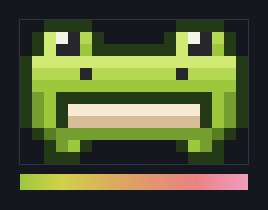
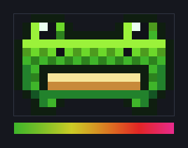
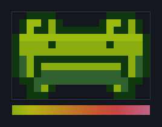

# 🐸 Claude Frog

A little pixel frog who dances while Claude Code is thinking — and quietly warns
you when you're burning too much context.

He starts composed and professional. The more of your context window you spend,
the goofier he gets. Past ~150k tokens he starts to shake. So his mood is an
honest, glanceable gauge: **calm = you're fine; unhinged = quality's about to
soften, wrap it up or `/compact` soon.**

He's the 🐸 emoji as pixel art, wearing the dusty rose of the Claude Code guy:
two eye bumps riding on a wide round head, dark inset eyes, nostril dots, and a
big open grin.

It's a self-inflicted CPU tax. That's the point. He's worth it.

---

## Two ways to run him

Both come from **one file, standard library only** — no `pip install`, no
dependencies. Pick either or run both.

### 🟢 Statusline frog (easiest to share)

A compact 3-row "mood frog" right in your Claude Code status bar. Zero setup
beyond one line of config. This is the one to send friends.

In `~/.claude/settings.json`:

```json
{
  "statusLine": {
    "type": "command",
    "command": "python3 /path/to/claude-frog/claude_frog.py statusline"
  }
}
```

That's it. He reads the token usage Claude Code hands the statusline and picks
his mood from it. (Statuslines only refresh ~1×/sec, so here he strikes *poses*
rather than dancing — for the full show, add the pane below.)

### 🕺 Dancing pane frog (tmux + WezTerm)

A dedicated tmux pane where he dances smoothly (~12 fps) for exactly as long as
Claude is working, then idles between turns — one frog per session, so a
parallel fan-out gives you a whole chorus line.

Add the hooks to `~/.claude/settings.json` (see
[`install/settings-hooks.json`](install/settings-hooks.json) for the full
block):

- `SessionStart` → spawns his pane (only if you're inside tmux)
- `UserPromptSubmit` → "a turn started, dance!" (+ counts turns)
- `Stop` → "turn's done, rest"
- `SessionEnd` → tears his pane down, no orphans

And the tmux toggle keybind (see
[`install/tmux.conf.snippet`](install/tmux.conf.snippet)):

```tmux
# prefix + F  →  hide / summon the frog   (capital F; find-window stays on f)
bind F run-shell "python3 /path/to/claude-frog/claude_frog.py toggle"
```

### 🤫 Pane-only, but still honest (`tap`)

Only the statusline is handed your token usage — the hooks are blind to it. So
if you want the dancing pane *without* a frog sitting in your status bar, don't
just drop the statusline: he'd fall back to guessing from turn count and you'd
lose the shake entirely.

Use `tap` instead. It reads the same payload and publishes the token gauge for
the pane, and prints **nothing**:

```json
{
  "statusLine": {
    "type": "command",
    "command": "python3 /path/to/claude-frog/claude_frog.py tap"
  }
}
```

Already have a statusline of your own? Keep it, and set `FROG_MODE="tap"` in
[`install/statusline-compose.sh`](install/statusline-compose.sh) — your bar
renders exactly as before, and the pane frog stays fully calibrated.

---

## The gauge (all tunable at the top of `claude_frog.py`)

| Context tokens | Claude Frog |
|---|---|
| ≤ 40k | composed, professional little bobs |
| 40k → 100k | progressively goofier — you can *watch* the context fill |
| ~100k | mostly unhinged |
| ≥ 120k | full chaos, frequent specials (backflips, big jumps) |
| ≥ 150k | he starts to shake, and shakes harder the deeper you go (capped so he stays legible) |

Anchored in **absolute tokens**, not percentage — so it's calibrated to when
long-context quality actually softens, and reads the same whether your window is
200k or 1M.

Flags: `--party` pins him to max goofiness + shake (always dancing);
`--always-dance` dances regardless of turn state.

### Rendering styles (pick per session)

He renders in three console-era styles. All three keep the green→pink context
gauge — each just expresses it in that console's idiom (the bar under each frog
is that theme's actual fade, fresh → full window):

| | Theme | Look |
|---|---|---|
|  | `snes` *(default)* | smooth 16-bit shading ramp, fading to Claude pink |
|  | `genesis` | punchy, oversaturated Mega Drive palette with cross-hatch **dithering**, fading to hot magenta |
|  | `gba` | the iconic 4-tone monochrome Game Boy LCD (pea-green), whose tint slides green→rose as context fills |

> Screenshots regenerate from the live palettes with `python3 assets/gen_screenshots.py`.
> How the themes and the launcher work under the hood — and how to add a theme —
> is in [`docs/themes.md`](docs/themes.md).

Choose one **when you start a Claude session**. The simplest way — just name the
console as the first word:

```sh
claude SNES      # smooth 16-bit frog
claude SEGA      # dithered Genesis frog
claude GBA       # mono Game Boy frog
```

That comes from a tiny shell wrapper
([`install/claude-theme.sh`](install/claude-theme.sh)) — source it once from
your `~/.zshrc` / `~/.bashrc`:

```sh
source /path/to/claude-frog/install/claude-theme.sh
```

It only steps in when that first word actually names a theme (case- and
spacing-insensitive — `SNES`, `nintendo`, `"Mega Drive"`, `gameboy` all work)
and passes everything else straight through, so plain `claude`, `claude -r`, and
`claude "fix the bug"` are untouched.

Under the hood it just sets the `CLAUDE_FROG_THEME` env var for that launch — so
if you'd rather not add a wrapper, set it yourself before starting Claude Code:

```sh
export CLAUDE_FROG_THEME=genesis   # or: gba, snes
```

Either way, both the statusline frog and the dancing pane read it (the pane
bakes the theme in at spawn, so it stays fixed for that session). You can also
pass `--theme` directly to any invocation. Preview them without installing
anything:

```sh
python3 claude_frog.py preview --theme genesis
python3 claude_frog.py preview --theme gba
python3 claude_frog.py dance --party --theme gba   # watch him lose it in mono
```

### Where the pane goes

`--layout top|bottom|left|right` (default `top`). `top`/`bottom` are 7-line
strips, `left`/`right` are 24-column side towers. He always stands on the pane's
floor, so the default `top` perches him directly above your prompt, looking down
at your work.

The pane is spawned by the `SessionStart` hook but toggled by the tmux keybind,
so rather than passing `--layout` to both, set it once:

```sh
export CLAUDE_FROG_LAYOUT=bottom
```

---

## How it works

```
UserPromptSubmit / Stop hooks ─┐
                               ├─► ~/.cache/claude-frog/<session>.think   (dance vs idle, turn count)
 statusline / tap (each ───────┼─► ~/.cache/claude-frog/<session>.ctx     (absolute context tokens)
   statusline refresh)         │
        pane daemon (12fps) ◄──┘   reads both, renders the frog
```

- **Hooks** own the *think-state* (they can't see tokens).
- **The statusline** owns the *token gauge* (only it can see tokens) and writes
  it to a file the daemon reads — `statusline` does that *and* draws a frog,
  `tap` does only the writing.
- Everything is keyed by session id, so multiple Claude Code sessions each get
  their own independent frog.
- The statusline and hook paths **never crash and always exit 0** — a broken
  frog can never break your prompt.

Rendering is Unicode half-blocks (`▀`/`▄`) with 24-bit truecolor: two pixels per
character cell, so he's real pixel art, not ASCII. Needs a truecolor terminal
(WezTerm, iTerm2, Kitty, modern tmux with `RGB`).

## Peek at him without installing anything

```sh
python3 claude_frog.py preview            # ASCII silhouette + color render
python3 claude_frog.py dance --party      # watch him lose it (Ctrl-C to stop)
```

## Composing with an existing statusline

Only one `statusLine` command is allowed, so if you already run one, wrap both.
See [`install/statusline-compose.sh`](install/statusline-compose.sh) for a small
wrapper that stacks your existing statusline on top of the frog.
