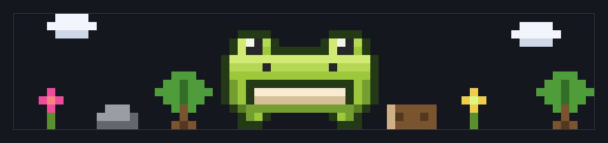
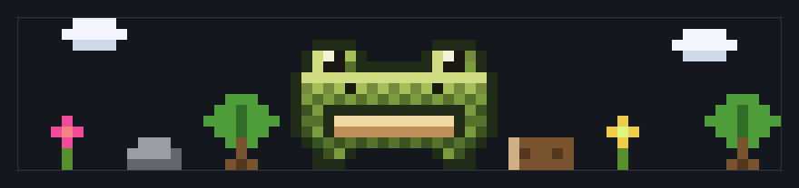
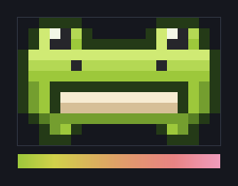
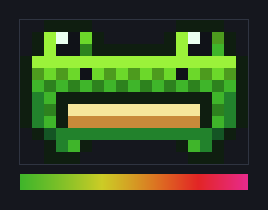
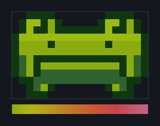
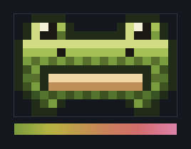

# 🐸 Claude Frog

A little pixel frog who dances while Claude Code is thinking — and quietly warns
you when you're burning too much context.

He starts composed and professional. The more of your context window you spend,
the goofier he gets. Past ~150k tokens he starts to shake. So his mood is an
honest, glanceable gauge: **calm = you're fine; unhinged = quality's about to
soften, wrap it up or `/compact` soon.**

He's the 🐸 emoji as pixel art, wearing the dusty rose of the Claude Code guy:
two eye bumps riding on a wide round head, dark inset eyes, nostril dots, and a
big open grin.

It's a self-inflicted CPU tax. That's the point. He's worth it.

---

## Get started (one command)

**You need:** macOS, Linux, or WSL (native Windows isn't supported), `python3`
**3.9 or newer** (macOS and most Linux distros ship one), **tmux** — a hard
requirement: the frog dances in a dedicated tmux pane, no tmux means no frog —
and a terminal with a font that draws the `▀`/`▄` half-block glyphs. A
**truecolor** terminal (WezTerm, iTerm2, Kitty) gets the real palettes;
anything else gets a 256-color approximation, and `NO_COLOR` is honored
(glyphs only) — `doctor` (below) reports which you're getting. `git` too,
for the one-liner.

### 1. Install

From nothing to a dancing frog:

```sh
curl -fsSL https://raw.githubusercontent.com/forgewurks-labs/claude-frog/main/bootstrap.sh | bash
```

That clones the repo to `~/.claude-frog`, then — after **showing you exactly what
it will touch and asking once** — sets up the whole frog: the `claude <THEME>`
launcher *and* the token feed + dance hooks that make his pane work. It
preserves everything already in your `~/.claude/settings.json` and backs the file
up first (to `settings.json.bak`).

Prefer to read before you run? Same result, nothing piped to a shell:

```sh
git clone https://github.com/forgewurks-labs/claude-frog.git ~/.claude-frog
~/.claude-frog/install.sh
```

Not in tmux? The wiring still installs cleanly, but the frog only appears in
his tmux pane — add tmux + WezTerm any time for the show.

Prefer a package manager? The repo is pip-installable:

```sh
pipx install git+https://github.com/forgewurks-labs/claude-frog
```

That puts a `claude-frog` command on your PATH — `claude-frog doctor`,
`claude-frog install-settings`, `claude-frog install-keybind`, and friends —
but not the `claude <THEME>` shell launcher, which ships with the installer
above.

### 2. Activate (the one unavoidable step)

No installer can reach into the terminal it's running in to load a new shell
command, so once it finishes:

```sh
# close this terminal and open a new one — or just run:
source ~/.zshrc          # (or ~/.bashrc)
```

### 3. Use it

Start a session and name a console as the first word — that's his theme for the
session:

```sh
claude SEGA              # or SNES, GBA, TERRARIA — name none and he wears SNES
```

Everything that isn't a theme name passes straight through, so `claude`,
`claude -r`, and `claude "fix the bug"` behave exactly as before. That's the
whole loop: **install → new terminal → `claude SEGA`.**

### Change how he looks (no dotfile editing)

The installer asks you once. After that, everything is one command:

```sh
python3 ~/.claude-frog/claude_frog.py config                  # what he's using, and WHY
python3 ~/.claude-frog/claude_frog.py config theme snes       # change it
python3 ~/.claude-frog/claude_frog.py config statusline frog  # a frog in your status bar too
python3 ~/.claude-frog/claude_frog.py config fade off         # stop the green→pink blush
python3 ~/.claude-frog/claude_frog.py setup                   # run the wizard again
```

`config` on its own prints the source of every value, which matters more than it
sounds:

```
  theme   terraria  from $CLAUDE_FROG_THEME
  layout  bottom    from ~/.config/claude-frog/config.json
  flora   on        default
  fade    on        default
```

Settings resolve **flag → `CLAUDE_FROG_*` env → config file → built-in default**.
So `claude SEGA` still overrides a single session, and an `export` line left in
a shell rc still wins — but now you can *see* that it does, instead of wondering
why your frog won't change colour.

### Verify / troubleshoot

The installer ends by running a **checkup** so you know it worked before you open
that new terminal. Run it yourself any time:

```sh
python3 ~/.claude-frog/claude_frog.py doctor
```

It reports on `python3`, the launcher line, the token feed + hooks, your theme,
and tmux. See a ⚠️? Re-run `~/.claude-frog/install.sh` — it's idempotent and safe
to run again.

### Options, updating, and removal

Flags go **straight to `install.sh`**, or after `bash -s --` when piping
(`curl … | bash -s -- --minimal`):

```sh
~/.claude-frog/install.sh --minimal    # ONLY the `claude <THEME>` launcher, no settings edits
~/.claude-frog/install.sh --yes        # skip the confirm prompt (for automation)
~/.claude-frog/install.sh --uninstall  # remove everything it added, restore your backups
```

**Update** to the latest by re-running the one-command install (it pulls, then
re-wires idempotently), or `git -C ~/.claude-frog pull`. **Remove** it completely
— launcher line *and* settings wiring, restoring your backups — with
`~/.claude-frog/install.sh --uninstall`.

### 🦎 Using him with opencode

The frog also dances for [opencode](https://opencode.ai) — same frog, same
pane, same gauge. There's no shell launcher to install for opencode; the
wiring is a single plugin file the frog writes (and removes) itself:

```sh
python3 ~/.claude-frog/claude_frog.py install-settings --agent opencode
python3 ~/.claude-frog/claude_frog.py doctor --agent opencode      # checkup
python3 ~/.claude-frog/claude_frog.py uninstall-settings --agent opencode
```

That drops `claude-frog.js` into `~/.config/opencode/plugin/` — opencode
loads it on startup, and it pipes session lifecycle and token usage to the
frog. He dances while opencode works, and the context gauge reads real token
counts (with the model's own window size). Pick his theme with
`python3 ~/.claude-frog/claude_frog.py config theme <name>` — the
per-session `claude SEGA` trick is a Claude Code launcher thing.

---

## How he runs

Everything comes from **one file, standard library only** — no `pip install`,
no dependencies. Two pieces work together: the **dancing pane** (where the frog
lives) and the **statusLine tap** (how he knows how deep in context you are —
and, if you want, a one-line frog of his own).

### 🕺 Dancing pane frog (tmux + WezTerm)

A dedicated tmux pane where he dances smoothly (~12 fps) for exactly as long as
Claude is working, then idles between turns.

**One frog per tmux window** — no matter how many Claude sessions that window
ends up holding. A headless `claude -p` fired off by a subagent, a nested
`claude`, a `/clear` that mints a fresh session id: they all join the frog
that's already there rather than splitting another pane beside him. He shows
whichever session is working right now, and he leaves when the last one does.
Want a chorus line? Open more windows.

Add the hooks to `~/.claude/settings.json` (see
[`install/settings-hooks.json`](install/settings-hooks.json) for the full
block):

- `SessionStart` → joins this window's frog, spawning his pane only if the
  window hasn't got one (and only if you're inside tmux)
- `UserPromptSubmit` → "a turn started, dance!" (+ counts turns)
- `Stop` → "turn's done, rest"
- `SessionEnd` → drops this session's claim; the last one out tears the pane
  down, so no orphans

And the tmux toggle keybind (see
[`install/tmux.conf.snippet`](install/tmux.conf.snippet)):

```tmux
# prefix + F  →  hide / summon the frog in this window   (capital F; find-window stays on f)
bind F run-shell "python3 /path/to/claude-frog/claude_frog.py toggle"
```

#### 🌷 A little diorama that grows as you work

<p align="center">
  
</p>
<p align="center">
  
  <br>
  <sub>The same scene in the <code>terraria</code> style — the frog wears the theme, the props stay natural.</sub>
</p>

Every prompt you send, the dancing pane sprouts one random prop around the frog
— a random-colored flower, a cloud, a rock, a tree, or a fallen log — that
animates in (flowers and trees grow up, rocks drop and settle, logs roll in,
clouds drift across the sky) and then stays. It's a quiet, honest tally of how
long you've been at it: a bare patch of grass at the start, a whole scene by the
end of a long session. Props live only in the pane, so the diorama resets when a
new session starts. It's on by default — `config flora off` to turn it off, or
tune `ENTRANCE_FRAMES` / `FLORA_MAX` at the top of `claude_frog.py`.

### 🤫 The token feed (`tap`)

Only the statusLine is handed your token usage — the hooks are blind to it. So
the frog "borrows" that surface: `tap` reads the payload and publishes the token
gauge for the pane. Skip it and he falls back to guessing goofiness from turn
count — and you lose the shake and the pink fade entirely.

The installer wires it for you; by hand it's one line in
`~/.claude/settings.json`:

```json
{
  "statusLine": {
    "type": "command",
    "command": "python3 /path/to/claude-frog/claude_frog.py tap"
  }
}
```

By default it prints **nothing** — your status bar stays yours. Unless you ask
for the status-bar frog:

### 🐸 The status-bar frog (one line)

```sh
python3 claude_frog.py config statusline frog     # off by default
```

He shows up as a single character row — a 2px frog, which is exactly one line
through the half-block renderer, so he costs you nothing vertically:

```
🐸 ▓▓▓▓▓░░░  78k · 39%
```

Two channels, deliberately:

- the bar's **length** is how full your *context window* is, and
- the bar's **colour** (and the frog's) is how *cooked* Claude is — the same
  absolute-token green→pink fade the pane frog wears.

A 1M window sitting at 200k reads "a fifth full, and he's gone pink," which is
the honest summary; one number couldn't say it. He wears your theme, blinks
occasionally, and gets the shakes past ~150k like his big brother. (`config fade
off` mutes the colour channel and leaves the length — see below.)

Turning it on doesn't change *which* command you wire — `tap` and `statusline`
behave identically, and neither draws anything until you opt in. So an existing
wiring of either keeps working, and an upgrade never starts scribbling in
somebody's status bar unasked.

Already have a statusline of your own? Keep it — point `statusLine` at
[`install/statusline-compose.sh`](install/statusline-compose.sh), which taps the
frog and then renders your bar on the same line.

---

## The gauge (all tunable at the top of `claude_frog.py`)

| Context tokens | Claude Frog |
|---|---|
| ≤ 40k | composed, professional little bobs |
| 40k → 100k | progressively goofier — you can *watch* the context fill |
| ~100k | mostly unhinged |
| ≥ 120k | full chaos, frequent specials (backflips, big jumps, and — rarely — he turns around and shakes his rump at you) |
| ≥ 150k | he starts to shake, and shakes harder the deeper you go (capped so he stays legible) |

Anchored in **absolute tokens**, not percentage — so it's calibrated to when
long-context quality actually softens, and reads the same whether your window is
200k or 1M.

Flags: `--party` pins him to max goofiness + shake (always dancing);
`--always-dance` dances regardless of turn state.

### Rendering styles (pick per session)

He renders in four pixel-art styles. All keep the green→pink context gauge —
each just expresses it in that style's idiom (the bar under each frog is that
theme's actual fade, fresh → full window):

| | Theme | Look |
|---|---|---|
|  | `snes` *(default)* | smooth 16-bit shading ramp, fading to Claude pink |
|  | `genesis` | punchy, oversaturated Mega Drive palette with cross-hatch **dithering**, fading to hot magenta |
|  | `gba` | the iconic 4-tone monochrome Game Boy LCD (pea-green), whose tint slides green→rose as context fills |
|  | `terraria` | high-fidelity, warm & painterly indie look — a fuller earthy ramp with desaturated outlines and **dithered** midtones, fading to a warm rose |

#### Prefer him one colour? `config fade off`

```sh
python3 claude_frog.py config fade off    # or CLAUDE_FROG_FADE=0 for one session
```

He then stays in his theme's own fresh palette forever — no blush, at any depth
— and the **gauge moves entirely into his dancing**: still composed below ~40k,
still unhinged by ~100k, still shaking past ~150k. Nothing about the ramps
changes; you're switching off one of the two channels reporting them.

The status bar follows the same rule: its length keeps tracking how full the
window is, it just stops recolouring. Worth it if you're on a theme whose green
you actually like, if pink-on-your-background is hard to read, or if a colour
that drifts all session is more motion than you want in your peripheral vision.

> Screenshots regenerate from the live palettes with `python3 assets/gen_screenshots.py`.
> How the themes and the launcher work under the hood — and how to add a theme —
> is in [`docs/themes.md`](docs/themes.md).

Choose one **when you start a Claude session**. The simplest way — just name the
console as the first word:

```sh
claude SNES      # smooth 16-bit frog
claude SEGA      # dithered Genesis frog
claude GBA       # mono Game Boy frog
claude TERRARIA  # painterly indie frog
```

That comes from a tiny shell wrapper
([`install/claude-theme.sh`](install/claude-theme.sh)). The
[one-command install](#get-started-one-command) sets it up along with the frog
himself; `./install.sh` from the repo root does the same locally. Want *only*
the theme command and no settings edits? Use `--minimal`:

```sh
./install.sh --minimal
```

That appends a `source` line to your `~/.zshrc` / `~/.bashrc` (it auto-detects
which), then open a new terminal. It's idempotent, edits nothing else, and the
wrapper finds `claude_frog.py` on its own — no paths to hand-edit. Prefer to do
it by hand? Add this one line yourself:

```sh
source /path/to/claude-frog/install/claude-theme.sh
```

The default `./install.sh` (no flags) does the whole thing — launcher **plus**
the token feed (tap) + hooks in `~/.claude/settings.json` so his pane works. It
preserves everything already in your settings, backs the file up first, won't
overwrite an existing statusline, is idempotent, and can be fully undone with
`./install.sh --uninstall`.

The wrapper only steps in when that first word actually names a theme (case- and
spacing-insensitive — `SNES`, `nintendo`, `"Mega Drive"`, `gameboy` all work)
and passes everything else straight through, so plain `claude`, `claude -r`, and
`claude "fix the bug"` are untouched. **Name no theme and the frog stays on the
default SNES** — as it does for an unset or unrecognized value, so he's never
left themeless.

Under the hood it just sets the `CLAUDE_FROG_THEME` env var for that launch — so
if you'd rather not add a wrapper, set it yourself before starting Claude Code:

```sh
export CLAUDE_FROG_THEME=genesis   # or: gba, snes, terraria
```

For a **permanent** choice, don't use an `export` — that pins every session and
is easy to forget you did. Save it instead:

```sh
python3 claude_frog.py config theme genesis
```

Either way, the dancing pane reads it (the theme is baked in at spawn, so it
stays fixed for that session). You can also pass `--theme` directly to any
invocation. Preview them without installing anything:

```sh
python3 claude_frog.py preview --theme genesis
python3 claude_frog.py preview --theme gba
python3 claude_frog.py dance --party --theme gba   # watch him lose it in mono
```

### Where the pane goes

`--layout top|bottom|left|right` (default `top`). `top`/`bottom` are 7-line
strips, `left`/`right` are 24-column side towers. He always stands on the pane's
floor, so the default `top` perches him directly above your prompt, looking down
at your work.

The pane is spawned by the `SessionStart` hook but toggled by the tmux keybind,
so rather than passing `--layout` to both, set it once:

```sh
python3 claude_frog.py config layout bottom
```

---

## How it works

```
UserPromptSubmit / Stop hooks ─┐
                               ├─► ~/.cache/claude-frog/<session>.think   (dance vs idle, turn count)
      tap (each statusLine ────┼─► ~/.cache/claude-frog/<session>.ctx     (absolute context tokens)
              refresh)         │
                               ├─► ~/.cache/claude-frog/win-<N>.json      (who owns this window's frog)
                               │
        pane daemon (12fps) ◄──┘   reads all three, renders the frog
```

- **Hooks** own the *think-state* (they can't see tokens).
- **The statusLine** owns the *token gauge* (only it can see tokens): `tap`
  reads the payload each refresh and writes it to a file the daemon reads,
  printing nothing.
- Session state is keyed by session id, but **the frog belongs to the tmux
  window**. Its record reference-counts the sessions living there and names the
  one currently working; the daemon follows that name, and the pane is only
  ever created when the window has none. That's what keeps it to one frog.
- A claim is dropped when the tmux pane its Claude was running in disappears —
  real liveness, so a crashed session can't hold a frog hostage.
- The tap and hook paths **never crash and always exit 0** — a broken frog can
  never break your prompt.

Rendering is Unicode half-blocks (`▀`/`▄`) with 24-bit truecolor: two pixels per
character cell, so he's real pixel art, not ASCII. In a truecolor terminal
(WezTerm, iTerm2, Kitty, modern tmux with `RGB`) you get the palettes as
designed; elsewhere they're quantized to xterm-256, and under `NO_COLOR` he's
drawn as uncolored glyphs.

## Peek at him without installing anything

```sh
python3 claude_frog.py preview            # ASCII silhouette + color render
python3 claude_frog.py dance --party      # watch him lose it (Ctrl-C to stop)
```

## Composing with an existing statusline

Only one `statusLine` command is allowed, so if you already run one, wrap both.
See [`install/statusline-compose.sh`](install/statusline-compose.sh) for a small
wrapper that taps the frog and then renders your bar on the same line. With the
status-bar frog off (the default) it's invisible; with it on you get
`🐸 ▓▓▓▓▓░░░ 78k · 39%  <your bar>`.

## License

[MIT](LICENSE) — do whatever makes you happy; the frog just wants to dance.
